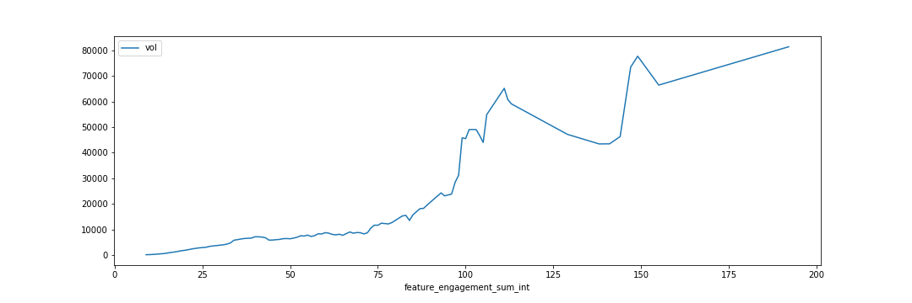
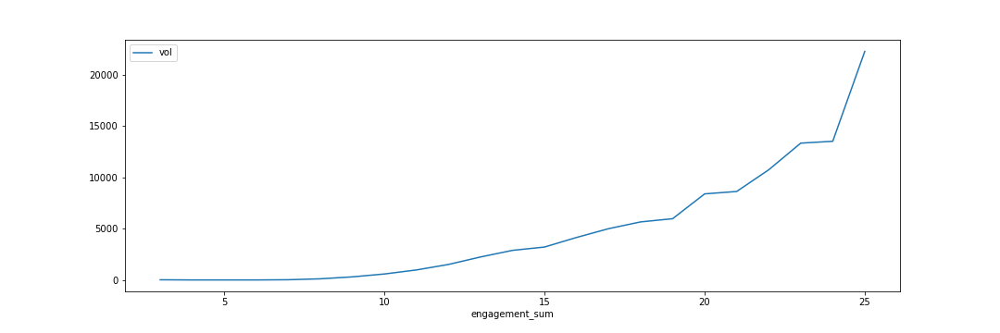
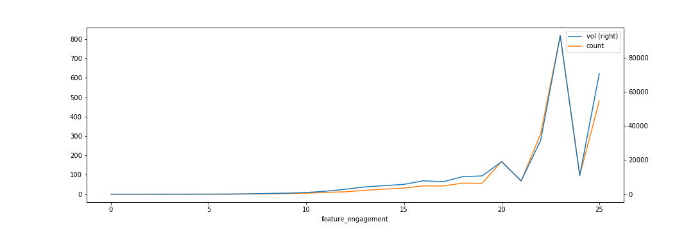
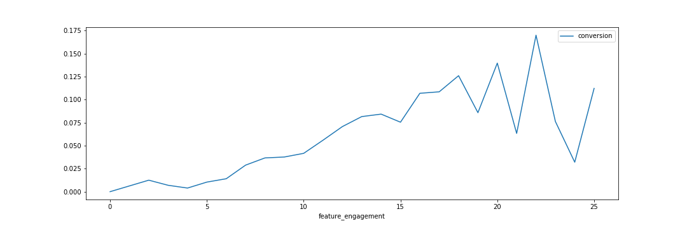

# Summary

I noticed a consistent theme for most features throughout the system that organizations more engaged, either using a feature more than others or using a feature that others were not, experienced greater fundraising success. I set out to quantify this, determine why this might be, and identify any features that might represent a gateway to greater system engagement. 

I have found further evidence of this effect but was unfortunately unable to find a causal link or identify any individual or subset of features that appeared to precipitate greater engagement with other features.

# Feature engagement as a metric

The feature engagement metric is a calculation of features activated/utilized by the organization. There is a bit of noise from outliers in the mean monthly volumes but the median monthly volume  proves to be a more reliable metric. We can see that, beyond the initial range of (0, 2), there is a clear correlation between greater feature engagement and greater median volume.

This is a non-purposefully weighted calculation. Where possible, features are counted by average monthly activations. This data is not available for all features so these other features are counted by active or inactive, 1 or 0, and as such their influence on the final value is significantly reduced.

| Engagement range | Mean vol    | Median vol  | Org count |
|------------------|:-----------:|:-----------:|:---------:|
| (0, 2)           | \$598.62    | \$106.50    | 293       |
| (2, 4)           | \$311.04    | \$0.67      | 859       |
| (4, 6)           | \$542.45    | \$20.80     | 680       |
| (6, 9)           | \$26,442.82 | \$218.29    | 656       |
| (9, 12)          | \$2,160.72  | \$1,016.34  | 349       |
| (12, 25)         | \$4,621.73  | \$2,671.28  | 685       |
| (25, 50)         | \$9,984.68  | \$5,668.10  | 371       |
| (50, 200)        | \$28,481.09 | \$12,901.21 | 148       |

This is an unweighted calculation. All features are counted equally by active or inactive, 1 or 0, so that no individual feature can overwhelm another by representation.

| Engagement range | Mean vol    | Median vol  | Org count |
|------------------|:-----------:|:-----------:|:---------:|
| (0, 2)           | \$684.72    | \$48.33     | 87        |
| (2, 4)           | \$26.39     | \$0.00      | 15        |
| (4, 6)           | \$94.18     | \$0.00      | 453       |
| (6, 9)           | \$14,172.87 | \$59.00     | 1237      |
| (9, 12)          | \$2,823.64  | \$893.21    | 1273      |
| (12, 15)         | \$7,361.50  | \$2,696.67  | 681       |
| (15, 20)         | \$12,714.03 | \$4,761.70  | 290       |
| (20, 25)         | \$17,130.59 | \$11,741.30 | 16        |

While the data becomes far more noisy due to lower sample sizes at higher engagement levels, there is a clear trend of greater feature engagement being positively associated not only with volume but also with transaction counts and conversion.

Specific features to median conversion

| Feature | Conversion Active | Conversion Inactive |
|---------|-------------------|---------------------|
| users_created | 4.17% | 2.67% |
| logins | 5.32% | 1.03% |
| integrations | 8.78% | 4.14% |
| page_updates | 3.92% | 4.67% |
| widgets_created | 8.74% | 4.14% |
| goals_saved | 8.78% | 4.14% |
| fundhub_builder_accessed | 8.74% | 4.14% |
| event_builder_accessed | 3.92% | 4.51% |
| form_builder_accessed | 4.52% | 4.15% |
| auctions | 10.71% | 4.14% |
| badges | 12.57% | 3.57% |
| thermometers | 4.78% | 4.03% |
| lists | 3.78% | 4.17% |
| smscampaigns | 3.74% | 4.17% |
| source_don_form | 4.21% | 2.40% |
| source_vt | 5.25% | 2.38% |
| source_p2p | 11.86% | 3.56% |
| source_kiosk | 12.18% | 3.97% |
| source_mobile | 4.98% | 3.07% |
| source_mobilevt | 6.95% | 3.69% |
| source_sms | 5.63% | 3.74% |
| source_fb | 7.40% | 3.96% |
| source_givi | 9.34% | 3.98% |
| recurring | 5.35% | 2.10% |
| donorlogins | 6.52% | 3.22% |
| logins_six_months | 5.52% | 1.40% |
| logins_three_months | 5.83% | 1.81% |
| logins_one_months | 6.32% | 2.25% |

Specific features to median page views

| Feature | Pageviews Active | Pageviews Inactive |
|---------|-------------------|---------------------|
| users_created | 111.85 | 13.0 |
| logins | 149.68 | 26.7 |
| integrations | 274.00 | 108.0 |
| page_updates | 106.93 | 115.5 |
| widgets_created | 285.40 | 107.3 |
| goals_saved | 274.00 | 108.0 |
| fundhub_builder_accessed | 272.00 | 108.0 |
| event_builder_accessed | 107.29 | 113.0 |
| form_builder_accessed | 273.33 | 101.9 |
| auctions | 273.33 | 106.9 |
| badges | 251.41 | 96.4 |
| thermometers | 232.26 | 82.3 |
| lists | 178.66 | 108.8 |
| smscampaigns | 198.65 | 108.8 |
| source_don_form | 115.89 | 18.0 |
| source_vt | 155.69 | 51.1 |
| source_p2p | 239.81 | 95.7 |
| source_kiosk | 199.24 | 105.3 |
| source_mobile | 206.29 | 47.3 |
| source_mobilevt | 270.90 | 90.9 |
| source_sms | 185.10 | 89.2 |
| source_fb | 283.18 | 100.6 |
| source_givi | 210.20 | 104.6 |
| recurring | 161.69 | 46.6 |
| donorlogins | 278.77 | 72.0 |
| logins_six_months | 163.67 | 34.7 |
| logins_three_months | 190.67 | 39.0 |
| logins_one_months | 234.31 | 45.1 |

# Total funds raised

There are again sufficient outliers to skew the data when looking at the mean funds raised so median is used. 

The median monthly volume per organization, grouped by feature activation.

| Feature          | Median Vol Active | Median Vol Inactive | Active Count | Active Percentage |
|------------------|:-----------------:|:-------------------:|:-----:|:----------:|
| auctions         | \$3,186.42        | \$344.31            | 129   | 3.19%      |
| badges           | \$1,972.74        | \$267.17            | 786   | 19.45%     |
| donorlogins      | \$2,284.41        | \$148.92            | 1023  | 25.31%     |
| event builder    | \$153.10          | \$665.14            | 2084  | 51.56%     |
| form builder     | \$1,153.86        | \$364.23            | 251   | 6.21%      |
| fundhub builder  | \$1,146.30        | \$383.09            | 66    | 1.63%      |
| goals saved    | \$762.75          | \$387.22            | 55    | 1.36%      |
| integrations     | \$762.75          | \$387.22            | 55    | 1.36%      |
| lists            | \$243.02          | \$396.32            | 124   | 3.07%      |
| logins 1 month   | \$1,729.49        | \$7.08              | 2184  | 54.03%     |
| logins 3 months  | \$1,295.25        | \$0.00              | 2615  | 64.70%     |
| logins 6 months  | \$996.75          | \$0.00              | 2962  | 73.28%     |
| logins 10 months | \$813.62          | \$0.00              | 3208  | 79.37%     |
| page updates     | \$181.62          | \$729.07            | 2472  | 61.16%     |
| recurring        | \$1,129.12        | \$10.14             | 2307  | 57.08%     |
| smscampaigns     | \$1,038.73        | \$383.09            | 120   | 2.97%      |
| source don form  | \$457.04          | \$1.00              | 3838  | 94.95%     |
| source fb        | \$2,925.78        | \$317.39            | 280   | 6.93%      |
| source givi      | \$2,633.81        | \$315.45            | 287   | 7.10%      |
| source kiosk     | \$1,675.00        | \$354.94            | 203   | 5.02%      |
| source mobile    | \$1,180.95        | \$79.62             | 1892  | 46.81%     |
| source mobilevt  | \$1,573.88        | \$282.58            | 548   | 13.56%     |
| source p2p       | \$1,784.79        | \$266.45            | 847   | 20.95%     |
| source sms       | \$896.15          | \$302.89            | 1106  | 27.36%     |
| source vt        | \$891.16          | \$73.20             | 2628  | 65.02%     |
| thermometers     | \$1,270.42        | \$264.08            | 942   | 23.31%     |
| users created    | \$411.97          | \$49.17             | 3954  | 97.82%     |
| widgets created  | \$1,288.54        | \$382.29            | 68    | 1.68%      |
| zendesk          | \$1,604.66        | \$95.00             | 1707  | 42.23%     |

With the exceptions of Page Updates, Lists and Event Builder, every feature correlates to significantly more funds. 

# Feature overlap

These are the percentage overlap between groups of feature utilization normalized by relative population sizes. There are some interesting intersections (ie, integrations, goals saved, and widgets created) but there is no consistent theme of strong universal overlap for any given feature. Most have only a few strongly overlapping groups but vary wildly from one feature to another for the rest.

|     |  auctions| badges| donorlogins| event_builder_accessed| form_builder_accessed| fundhub_builder_accessed| goals_saved| integrations| lists| logins| logins_one_months| logins_six_months| logins_three_months| page_updates| recurring| smscampaigns| source_don_form| source_fb| source_givi| source_kiosk| source_mobile| source_mobilevt| source_p2p| source_sms| source_vt| thermometers| users_created| widgets_created |
|------|------|------|------|------|------|------|------|------|------|------|------|------|------|------|------|------|------|------|------|------|------|------|------|------|------|------|------|------|
| auctions | nan | 4.7% | 2.0% | 2.4% | 3.5% | 1.6% | 1.7% | 1.7% | 4.5% | 3.9% | 4.8% | 4.1% | 4.3% | 2.4% | 2.0% | 5.5% | 3.4% | 3.8% | 43.0% | 1.8% | 2.4% | 3.5% | 4.4% | 3.2% | 4.7% | 3.3% | 3.3% | 1.5% |
| badges | 4.7% | nan | 11.6% | 18.8% | 5.8% | 2.4% | 2.2% | 2.2% | 4.7% | 21.3% | 22.1% | 21.5% | 21.2% | 19.3% | 14.9% | 5.6% | 19.4% | 11.6% | 7.2% | 2.6% | 15.1% | 11.4% | 91.0% | 18.2% | 25.9% | 17.4% | 19.9% | 2.5% |
| donorlogins | 2.0% | 11.6% | nan | 22.0% | 9.1% | 3.0% | 2.5% | 2.5% | 2.9% | 29.5% | 32.5% | 30.3% | 31.4% | 22.6% | 43.9% | 2.7% | 26.6% | 13.5% | 9.3% | 11.5% | 37.8% | 19.3% | 12.9% | 20.9% | 31.8% | 21.1% | 25.9% | 3.1% |
| event_builder_accessed | 2.4% | 18.8% | 22.0% | nan | 12.0% | 3.2% | 2.6% | 2.6% | 3.2% | 35.9% | 27.3% | 30.5% | 29.0% | 84.3% | 38.4% | 2.8% | 51.0% | 7.2% | 5.3% | 6.4% | 35.2% | 16.3% | 20.1% | 26.2% | 46.7% | 19.8% | 52.7% | 3.3% |
| form_builder_accessed | 3.5% | 5.8% | 9.1% | 12.0% | nan | 26.3% | 21.9% | 21.9% | 3.9% | 6.7% | 6.6% | 5.8% | 6.0% | 10.2% | 9.1% | 3.9% | 6.5% | 5.8% | 3.7% | 6.1% | 9.4% | 9.2% | 6.3% | 7.7% | 8.4% | 6.0% | 6.3% | 27.1% |
| fundhub_builder_accessed | 1.6% | 2.4% | 3.0% | 3.2% | 26.3% | nan | 83.3% | 83.3% | 0.5% | 1.9% | 1.5% | 1.3% | 1.4% | 2.7% | 2.4% | 0.5% | 1.7% | 2.7% | 1.1% | 3.1% | 2.1% | 3.0% | 2.4% | 1.8% | 2.2% | 1.5% | 1.7% | 97.1% |
| goals_saved | 1.7% | 2.2% | 2.5% | 2.6% | 21.9% | 83.3% | nan | 100.0% | 0.6% | 1.6% | 1.2% | 1.1% | 1.1% | 2.2% | 2.0% | 0.6% | 1.4% | 2.1% | 1.2% | 2.4% | 1.6% | 2.9% | 2.2% | 1.4% | 1.7% | 1.4% | 1.4% | 80.9% |
| integrations | 1.7% | 2.2% | 2.5% | 2.6% | 21.9% | 83.3% | 100.0% | nan | 0.6% | 1.6% | 1.2% | 1.1% | 1.1% | 2.2% | 2.0% | 0.6% | 1.4% | 2.1% | 1.2% | 2.4% | 1.6% | 2.9% | 2.2% | 1.4% | 1.7% | 1.4% | 1.4% | 80.9% |
| lists | 4.5% | 4.7% | 2.9% | 3.2% | 3.9% | 0.5% | 0.6% | 0.6% | nan | 3.4% | 3.0% | 3.2% | 2.9% | 3.5% | 2.6% | 59.5% | 2.9% | 2.0% | 4.3% | 2.2% | 3.1% | 3.9% | 4.2% | 9.6% | 2.8% | 6.1% | 3.1% | 0.5% |
| logins | 3.9% | 21.3% | 29.5% | 35.9% | 6.7% | 1.9% | 1.6% | 1.6% | 3.4% | nan | 68.1% | 92.3% | 81.5% | 44.5% | 60.6% | 3.5% | 80.9% | 8.1% | 8.4% | 5.5% | 49.6% | 15.2% | 22.8% | 26.3% | 60.0% | 25.3% | 81.1% | 2.0% |
| logins_one_months | 4.8% | 22.1% | 32.5% | 27.3% | 6.6% | 1.5% | 1.2% | 1.2% | 3.0% | 68.1% | nan | 73.7% | 83.5% | 29.9% | 53.3% | 3.4% | 56.0% | 9.8% | 9.9% | 6.1% | 46.8% | 17.1% | 23.4% | 24.8% | 49.6% | 25.8% | 55.2% | 1.6% |
| logins_six_months | 4.1% | 21.5% | 30.3% | 30.5% | 5.8% | 1.3% | 1.1% | 1.1% | 3.2% | 92.3% | 73.7% | nan | 88.3% | 38.4% | 60.4% | 3.4% | 75.1% | 8.5% | 8.8% | 5.5% | 49.5% | 15.6% | 22.9% | 25.6% | 58.4% | 25.5% | 74.9% | 1.4% |
| logins_three_months | 4.3% | 21.2% | 31.4% | 29.0% | 6.0% | 1.4% | 1.1% | 1.1% | 2.9% | 81.5% | 83.5% | 88.3% | nan | 32.6% | 58.4% | 3.2% | 66.7% | 9.2% | 9.3% | 5.7% | 48.8% | 16.1% | 22.7% | 25.2% | 54.9% | 25.9% | 66.1% | 1.5% |
| page_updates | 2.4% | 19.3% | 22.6% | 84.3% | 10.2% | 2.7% | 2.2% | 2.2% | 3.5% | 44.5% | 29.9% | 38.4% | 32.6% | nan | 42.8% | 3.1% | 60.5% | 6.8% | 5.6% | 5.9% | 37.4% | 15.8% | 20.5% | 27.3% | 51.3% | 21.0% | 62.5% | 2.8% |
| recurring | 2.0% | 14.9% | 43.9% | 38.4% | 9.1% | 2.4% | 2.0% | 2.0% | 2.6% | 60.6% | 53.3% | 60.4% | 58.4% | 42.8% | nan | 2.5% | 59.4% | 10.0% | 7.1% | 7.7% | 57.3% | 17.8% | 16.2% | 25.3% | 58.7% | 25.3% | 58.3% | 2.5% |
| smscampaigns | 5.5% | 5.6% | 2.7% | 2.8% | 3.9% | 0.5% | 0.6% | 0.6% | 59.5% | 3.5% | 3.4% | 3.4% | 3.2% | 3.1% | 2.5% | nan | 2.8% | 2.3% | 4.6% | 2.2% | 2.9% | 3.9% | 5.0% | 9.0% | 3.0% | 5.7% | 3.0% | 0.5% |
| source_don_form | 3.4% | 19.4% | 26.6% | 51.0% | 6.5% | 1.7% | 1.4% | 1.4% | 2.9% | 80.9% | 56.0% | 75.1% | 66.7% | 60.5% | 59.4% | 2.8% | nan | 7.2% | 7.4% | 5.1% | 49.1% | 14.2% | 20.9% | 27.0% | 64.5% | 23.8% | 97.1% | 1.7% |
| source_fb | 3.8% | 11.6% | 13.5% | 7.2% | 5.8% | 2.7% | 2.1% | 2.1% | 2.0% | 8.1% | 9.8% | 8.5% | 9.2% | 6.8% | 10.0% | 2.3% | 7.2% | nan | 6.2% | 6.2% | 10.5% | 11.9% | 11.8% | 11.2% | 9.5% | 9.0% | 7.1% | 2.7% |
| source_givi | 43.0% | 7.2% | 9.3% | 5.3% | 3.7% | 1.1% | 1.2% | 1.2% | 4.3% | 8.4% | 9.9% | 8.8% | 9.3% | 5.6% | 7.1% | 4.6% | 7.4% | 6.2% | nan | 7.0% | 7.3% | 7.9% | 7.0% | 7.2% | 9.2% | 6.4% | 7.3% | 1.1% |
| source_kiosk | 1.8% | 2.6% | 11.5% | 6.4% | 6.1% | 3.1% | 2.4% | 2.4% | 2.2% | 5.5% | 6.1% | 5.5% | 5.7% | 5.9% | 7.7% | 2.2% | 5.1% | 6.2% | 7.0% | nan | 7.5% | 10.9% | 3.1% | 8.0% | 6.7% | 4.6% | 5.1% | 3.4% |
| source_mobile | 2.4% | 15.1% | 37.8% | 35.2% | 9.4% | 2.1% | 1.6% | 1.6% | 3.1% | 49.6% | 46.8% | 49.5% | 48.8% | 37.4% | 57.3% | 2.9% | 49.1% | 10.5% | 7.3% | 7.5% | nan | 19.8% | 16.3% | 26.8% | 50.2% | 27.1% | 47.9% | 2.2% |
| source_mobilevt | 3.5% | 11.4% | 19.3% | 16.3% | 9.2% | 3.0% | 2.9% | 2.9% | 3.9% | 15.2% | 17.1% | 15.6% | 16.1% | 15.8% | 17.8% | 3.9% | 14.2% | 11.9% | 7.9% | 10.9% | 19.8% | nan | 12.0% | 16.6% | 17.8% | 14.5% | 13.9% | 3.0% |
| source_p2p | 4.4% | 91.0% | 12.9% | 20.1% | 6.3% | 2.4% | 2.2% | 2.2% | 4.2% | 22.8% | 23.4% | 22.9% | 22.7% | 20.5% | 16.2% | 5.0% | 20.9% | 11.8% | 7.0% | 3.1% | 16.3% | 12.0% | nan | 18.9% | 27.7% | 18.1% | 21.4% | 2.5% |
| source_sms | 3.2% | 18.2% | 20.9% | 26.2% | 7.7% | 1.8% | 1.4% | 1.4% | 9.6% | 26.3% | 24.8% | 25.6% | 25.2% | 27.3% | 25.3% | 9.0% | 27.0% | 11.2% | 7.2% | 8.0% | 26.8% | 16.6% | 18.9% | nan | 27.1% | 29.9% | 28.0% | 1.9% |
| source_vt | 4.7% | 25.9% | 31.8% | 46.7% | 8.4% | 2.2% | 1.7% | 1.7% | 2.8% | 60.0% | 49.6% | 58.4% | 54.9% | 51.3% | 58.7% | 3.0% | 64.5% | 9.5% | 9.2% | 6.7% | 50.2% | 17.8% | 27.7% | 27.1% | nan | 24.1% | 66.5% | 2.2% |
| thermometers | 3.3% | 17.4% | 21.1% | 19.8% | 6.0% | 1.5% | 1.4% | 1.4% | 6.1% | 25.3% | 25.8% | 25.5% | 25.9% | 21.0% | 25.3% | 5.7% | 23.8% | 9.0% | 6.4% | 4.6% | 27.1% | 14.5% | 18.1% | 29.9% | 24.1% | nan | 23.8% | 1.5% |
| users_created | 3.3% | 19.9% | 25.9% | 52.7% | 6.3% | 1.7% | 1.4% | 1.4% | 3.1% | 81.1% | 55.2% | 74.9% | 66.1% | 62.5% | 58.3% | 3.0% | 97.1% | 7.1% | 7.3% | 5.1% | 47.9% | 13.9% | 21.4% | 28.0% | 66.5% | 23.8% | nan | 1.7% |
| widgets_created | 1.5% | 2.5% | 3.1% | 3.3% | 27.1% | 97.1% | 80.9% | 80.9% | 0.5% | 2.0% | 1.6% | 1.4% | 1.5% | 2.8% | 2.5% | 0.5% | 1.7% | 2.7% | 1.1% | 3.4% | 2.2% | 3.0% | 2.5% | 1.9% | 2.2% | 1.5% | 1.7% | nan |

## Feature usage correlation

The correlation between feature usage is unfortunately just as inconsistent as the feature overlap percentages. There is no singular, notable feature that appears to strongly correlate with everything else and most strongly correlating features are technically associated features such as event builder accessed and CMS page updates or lists and SMS campaigns.

|     |  users_created| logins| integrations| page_updates| widgets_created| goals_saved| fundhub_builder_accessed| event_builder_accessed| form_builder_accessed| auctions| badges| thermometers| lists| smscampaigns| source_don_form| source_vt| source_p2p| source_kiosk| source_mobile| source_mobilevt| source_fb| source_sms| source_givi| recurring| donorlogins| logins_six_months| logins_three_months| logins_one_months |
|------|------|------|------|------|------|------|------|------|------|------|------|------|------|------|------|------|------|------|------|------|------|------|------|------|------|------|------|------|
| users_created | 100.0% | 30.9% | -0.4% | -1.4% | -1.0% | -0.4% | -1.0% | -1.2% | -1.4% | 19.8% | 21.3% | 11.4% | 3.1% | 6.0% | 30.0% | 11.9% | 21.0% | 0.6% | -1.0% | 6.6% | 4.6% | 13.3% | 14.5% | -8.4% | -4.4% | 11.3% | 11.1% | 12.2% |
| logins | 30.9% | 100.0% | -0.7% | -0.9% | -0.8% | -0.7% | -0.8% | -1.0% | -0.8% | 26.7% | 35.3% | 22.3% | 5.7% | 10.0% | 26.0% | 29.5% | 34.2% | 3.8% | 22.3% | 13.3% | 20.3% | 19.3% | 26.9% | 24.1% | 25.6% | 40.4% | 43.1% | 45.7% |
| integrations | -0.4% | -0.7% | 100.0% | 99.8% | 99.9% | 100.0% | 99.9% | 99.8% | 99.8% | -0.0% | -0.7% | -0.8% | -0.3% | -0.3% | 1.2% | -1.8% | -0.8% | -0.1% | -1.4% | -0.3% | -0.4% | -0.8% | -0.3% | 1.9% | 3.2% | -2.8% | -2.4% | -1.9% |
| page_updates | -1.4% | -0.9% | 99.8% | 100.0% | 100.0% | 99.8% | 100.0% | 100.0% | 100.0% | -0.3% | -0.7% | -0.8% | -0.3% | -0.3% | 0.9% | -2.0% | -0.8% | -0.3% | -1.4% | -0.6% | -0.4% | -0.9% | -0.4% | 1.7% | 3.0% | -2.6% | -2.2% | -1.8% |
| widgets_created | -1.0% | -0.8% | 99.9% | 100.0% | 100.0% | 99.9% | 100.0% | 100.0% | 100.0% | -0.2% | -0.7% | -0.8% | -0.3% | -0.3% | 1.0% | -1.9% | -0.8% | -0.2% | -1.4% | -0.5% | -0.4% | -0.9% | -0.4% | 1.9% | 3.1% | -2.6% | -2.2% | -1.8% |
| goals_saved | -0.4% | -0.7% | 100.0% | 99.8% | 99.9% | 100.0% | 99.9% | 99.8% | 99.8% | -0.0% | -0.7% | -0.8% | -0.3% | -0.3% | 1.2% | -1.8% | -0.8% | -0.1% | -1.4% | -0.3% | -0.4% | -0.8% | -0.3% | 1.9% | 3.2% | -2.8% | -2.4% | -1.9% |
| fundhub_builder_accessed | -1.0% | -0.8% | 99.9% | 100.0% | 100.0% | 99.9% | 100.0% | 100.0% | 100.0% | -0.2% | -0.7% | -0.8% | -0.3% | -0.3% | 1.0% | -1.9% | -0.8% | -0.2% | -1.4% | -0.5% | -0.4% | -0.9% | -0.4% | 1.9% | 3.1% | -2.6% | -2.2% | -1.8% |
| event_builder_accessed | -1.2% | -1.0% | 99.8% | 100.0% | 100.0% | 99.8% | 100.0% | 100.0% | 100.0% | -0.3% | -0.7% | -0.8% | -0.3% | -0.3% | 1.0% | -1.9% | -0.7% | -0.3% | -1.5% | -0.5% | -0.4% | -0.9% | -0.5% | 1.7% | 3.0% | -2.8% | -2.4% | -1.9% |
| form_builder_accessed | -1.4% | -0.8% | 99.8% | 100.0% | 100.0% | 99.8% | 100.0% | 100.0% | 100.0% | -0.3% | -0.8% | -0.8% | -0.3% | -0.3% | 0.9% | -2.0% | -0.8% | -0.3% | -1.4% | -0.6% | -0.4% | -0.9% | -0.4% | 1.8% | 3.1% | -2.5% | -2.1% | -1.7% |
| auctions | 19.8% | 26.7% | -0.0% | -0.3% | -0.2% | -0.0% | -0.2% | -0.3% | -0.3% | 100.0% | 5.4% | 1.4% | 4.3% | 6.2% | 9.6% | 14.8% | 4.6% | 0.1% | -1.8% | 3.1% | 4.1% | 1.2% | 66.3% | -5.2% | -2.3% | 12.6% | 12.2% | 12.5% |
| badges | 21.3% | 35.3% | -0.7% | -0.7% | -0.7% | -0.7% | -0.7% | -0.7% | -0.8% | 5.4% | 100.0% | 12.3% | 5.6% | 8.5% | 15.4% | 31.2% | 94.5% | -4.1% | 1.9% | 6.9% | 15.2% | 12.3% | 4.7% | 0.2% | 0.7% | 19.7% | 17.5% | 18.3% |
| thermometers | 11.4% | 22.3% | -0.8% | -0.8% | -0.8% | -0.8% | -0.8% | -0.8% | -0.8% | 1.4% | 12.3% | 100.0% | 11.1% | 9.8% | 15.9% | 15.2% | 12.6% | 1.5% | 23.7% | 12.3% | 9.6% | 30.0% | 2.2% | 18.8% | 17.0% | 18.6% | 19.3% | 19.3% |
| lists | 3.1% | 5.7% | -0.3% | -0.3% | -0.3% | -0.3% | -0.3% | -0.3% | -0.3% | 4.3% | 5.6% | 11.1% | 100.0% | 73.6% | -0.2% | -0.5% | 4.0% | 0.5% | 2.2% | 4.1% | 0.4% | 23.6% | 4.2% | -1.1% | 0.5% | 5.4% | 2.1% | 2.2% |
| smscampaigns | 6.0% | 10.0% | -0.3% | -0.3% | -0.3% | -0.3% | -0.3% | -0.3% | -0.3% | 6.2% | 8.5% | 9.8% | 73.6% | 100.0% | 1.6% | 2.0% | 6.9% | 0.6% | 1.7% | 4.1% | 1.1% | 22.7% | 5.0% | -0.6% | -0.0% | 7.8% | 5.6% | 5.4% |
| source_don_form | 30.0% | 26.0% | 1.2% | 0.9% | 1.0% | 1.2% | 1.0% | 1.0% | 0.9% | 9.6% | 15.4% | 15.9% | -0.2% | 1.6% | 100.0% | 24.8% | 16.1% | 5.8% | 26.1% | 13.6% | 10.0% | 13.2% | 10.9% | 22.3% | 16.4% | 39.8% | 38.0% | 36.9% |
| source_vt | 11.9% | 29.5% | -1.8% | -2.0% | -1.9% | -1.8% | -1.9% | -1.9% | -2.0% | 14.8% | 31.2% | 15.2% | -0.5% | 2.0% | 24.8% | 100.0% | 32.0% | 12.3% | 33.0% | 22.3% | 16.6% | 13.2% | 14.6% | 36.9% | 28.1% | 24.8% | 26.9% | 27.7% |
| source_p2p | 21.0% | 34.2% | -0.8% | -0.8% | -0.8% | -0.8% | -0.8% | -0.7% | -0.8% | 4.6% | 94.5% | 12.6% | 4.0% | 6.9% | 16.1% | 32.0% | 100.0% | -2.9% | 2.5% | 7.3% | 15.7% | 12.5% | 4.0% | 1.0% | 2.0% | 19.6% | 17.8% | 18.5% |
| source_kiosk | 0.6% | 3.8% | -0.1% | -0.3% | -0.2% | -0.1% | -0.2% | -0.3% | -0.3% | 0.1% | -4.1% | 1.5% | 0.5% | 0.6% | 5.8% | 12.3% | -2.9% | 100.0% | 14.2% | 16.9% | 6.1% | 10.7% | 7.1% | 16.9% | 20.9% | 6.8% | 6.7% | 8.0% |
| source_mobile | -1.0% | 22.3% | -1.4% | -1.4% | -1.4% | -1.4% | -1.4% | -1.5% | -1.4% | -1.8% | 1.9% | 23.7% | 2.2% | 1.7% | 26.1% | 33.0% | 2.5% | 14.2% | 100.0% | 24.4% | 15.9% | 15.4% | 4.6% | 49.7% | 40.0% | 29.7% | 32.5% | 34.1% |
| source_mobilevt | 6.6% | 13.3% | -0.3% | -0.6% | -0.5% | -0.3% | -0.5% | -0.5% | -0.6% | 3.1% | 6.9% | 12.3% | 4.1% | 4.1% | 13.6% | 22.3% | 7.3% | 16.9% | 24.4% | 100.0% | 13.8% | 16.1% | 7.5% | 21.7% | 21.4% | 15.3% | 16.0% | 17.5% |
| source_fb | 4.6% | 20.3% | -0.4% | -0.4% | -0.4% | -0.4% | -0.4% | -0.4% | -0.4% | 4.1% | 15.2% | 9.6% | 0.4% | 1.1% | 10.0% | 16.6% | 15.7% | 6.1% | 15.9% | 13.8% | 100.0% | 14.2% | 6.1% | 17.8% | 20.7% | 14.0% | 15.6% | 15.8% |
| source_sms | 13.3% | 19.3% | -0.8% | -0.9% | -0.9% | -0.8% | -0.9% | -0.9% | -0.9% | 1.2% | 12.3% | 30.0% | 23.6% | 22.7% | 13.2% | 13.2% | 12.5% | 10.7% | 15.4% | 16.1% | 14.2% | 100.0% | 3.2% | 10.6% | 12.4% | 8.7% | 9.6% | 10.9% |
| source_givi | 14.5% | 26.9% | -0.3% | -0.4% | -0.4% | -0.3% | -0.4% | -0.5% | -0.4% | 66.3% | 4.7% | 2.2% | 4.2% | 5.0% | 10.9% | 14.6% | 4.0% | 7.1% | 4.6% | 7.5% | 6.1% | 3.2% | 100.0% | 3.5% | 9.4% | 15.9% | 16.2% | 16.4% |
| recurring | -8.4% | 24.1% | 1.9% | 1.7% | 1.9% | 1.9% | 1.9% | 1.7% | 1.8% | -5.2% | 0.2% | 18.8% | -1.1% | -0.6% | 22.3% | 36.9% | 1.0% | 16.9% | 49.7% | 21.7% | 17.8% | 10.6% | 3.5% | 100.0% | 53.7% | 36.9% | 40.5% | 41.2% |
| donorlogins | -4.4% | 25.6% | 3.2% | 3.0% | 3.1% | 3.2% | 3.1% | 3.0% | 3.1% | -2.3% | 0.7% | 17.0% | 0.5% | -0.0% | 16.4% | 28.1% | 2.0% | 20.9% | 40.0% | 21.4% | 20.7% | 12.4% | 9.4% | 53.7% | 100.0% | 27.2% | 29.6% | 32.1% |
| logins_six_months | 11.3% | 40.4% | -2.8% | -2.6% | -2.6% | -2.8% | -2.6% | -2.8% | -2.5% | 12.6% | 19.7% | 18.6% | 5.4% | 7.8% | 39.8% | 24.8% | 19.6% | 6.8% | 29.7% | 15.3% | 14.0% | 8.7% | 15.9% | 36.9% | 27.2% | 100.0% | 86.2% | 73.3% |
| logins_three_months | 11.1% | 43.1% | -2.4% | -2.2% | -2.2% | -2.4% | -2.2% | -2.4% | -2.1% | 12.2% | 17.5% | 19.3% | 2.1% | 5.6% | 38.0% | 26.9% | 17.8% | 6.7% | 32.5% | 16.0% | 15.6% | 9.6% | 16.2% | 40.5% | 29.6% | 86.2% | 100.0% | 84.4% |
| logins_one_months | 12.2% | 45.7% | -1.9% | -1.8% | -1.8% | -1.9% | -1.8% | -1.9% | -1.7% | 12.5% | 18.3% | 19.3% | 2.2% | 5.4% | 36.9% | 27.7% | 18.5% | 8.0% | 34.1% | 17.5% | 15.8% | 10.9% | 16.4% | 41.2% | 32.1% | 73.3% | 84.4% | 100.0% |

